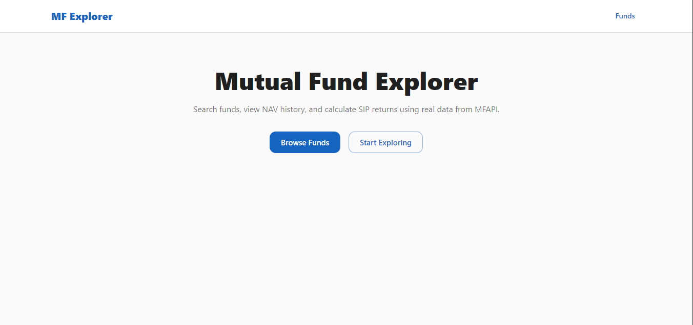
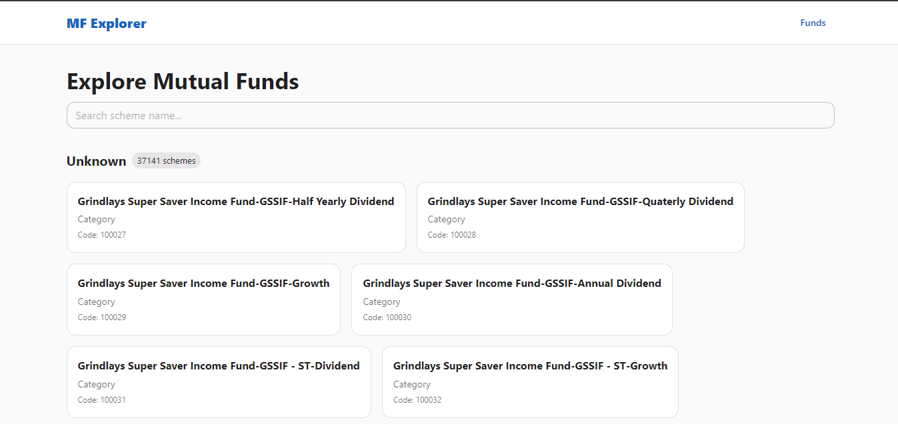
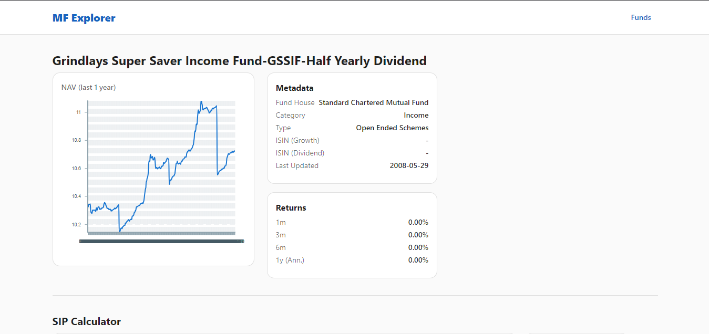

# 🚀 Mutual Fund Explorer + SIP Calculator

<div align="center">


[](https://mutual-fund-explorer-with-sip-calcu-mu.vercel.app/)
[](https://vercel.com/new/clone?repository-url=https://github.com/your-repo/mutual-fund-explorer)

</div>

## 📸 Screenshots

<div align="center">

### 🏠 Home Page


### 📊 Funds Listing


### 🧮 SIP Calculator


</div>

## 🎯 Overview

This comprehensive mutual fund explorer wraps the public MFAPI.in endpoints and provides a fast, responsive UI to explore mutual funds, view NAV charts, and calculate SIP returns with advanced features.

## 🛠️ Tech Stack

- **Frontend**: Next.js 15.5.4 (App Router), React 19.1.0
- **UI Library**: Material UI (MUI) v5 + Victory Charts
- **Data Fetching**: SWR for caching and API calls
- **Date Handling**: dayjs for date manipulation
- **Styling**: Tailwind CSS + MUI components
- **Charts**: Victory Charts for interactive visualizations

## 🚀 Quick Start

### Prerequisites
- Node.js 18+ 
- npm or yarn

### Installation

1. **Clone the repository**
```bash
git clone https://github.com/your-repo/mutual-fund-explorer.git
cd mutual-fund-explorer
```

2. **Install dependencies**
```bash
npm install
```

3. **Run the development server**
```bash
npm run dev
```

4. **Open your browser**
Navigate to [http://localhost:3000](http://localhost:3000) or visit the live demo below

### 🚀 Deploy to Vercel

[](https://vercel.com/new/clone?repository-url=https://github.com/your-repo/mutual-fund-explorer)

### 🌐 Try Live Demo

<div align="center">

[](https://mutual-fund-explorer-with-sip-calcu-mu.vercel.app/)

<a href="https://mutual-fund-explorer-with-sip-calcu-mu.vercel.app/" target="_blank" rel="noopener noreferrer">
  
</a>

</div>

## 🔧 API Routes

| Route | Method | Description |
|-------|--------|-------------|
| `/api/mf` | GET | List all schemes (cached 24h) |
| `/api/scheme/[code]` | GET | Scheme metadata + normalized NAV history |
| `/api/scheme/[code]/returns` | GET | Returns calculation with query params |
| `/api/scheme/[code]/sip` | POST | SIP calculation |

### SIP Request Example
```json
{
  "amount": 5000,
  "frequency": "monthly",
  "from": "2020-01-01",
  "to": "2023-12-31"
}
```

## 📱 Features

### 🏠 Pages
- **`/`** – Modern landing page with feature highlights
- **`/funds`** – Searchable fund listing grouped by fund house
- **`/scheme/[code]`** – Detailed scheme analysis with interactive charts

### 📊 Key Features
- ✅ **Real-time NAV Charts** - Interactive Victory charts with zoom/pan
- ✅ **SIP Calculator** - Calculate returns with historical data
- ✅ **Fund Search** - Debounced search with instant results
- ✅ **Responsive Design** - Mobile-first approach with MUI
- ✅ **Performance Optimized** - In-memory caching + SWR
- ✅ **Modern UI/UX** - Glassmorphism cards and smooth animations

## ⚡ Performance & Caching

- **Server-side**: In-memory cache with 24h TTL for API responses
- **Client-side**: SWR for intelligent data fetching and caching
- **Optimization**: Lazy-loaded charts and debounced search

## 🎨 UI/UX Highlights

- **Material Design**: Clean, professional fintech aesthetic
- **Victory Charts**: Interactive, responsive data visualizations
- **Smooth Animations**: Framer Motion for page transitions
- **Mobile-First**: Responsive design for all screen sizes
- **Accessibility**: ARIA labels and keyboard navigation

## 📊 Data Source

- **API**: [MFAPI.in](https://www.mfapi.in/) - Real mutual fund data
- **Coverage**: All Indian mutual fund schemes
- **Updates**: Daily NAV updates

## ⚠️ Disclaimer

This application is for **educational and informational purposes only**. 
- Always verify calculations before making financial decisions
- Past performance does not guarantee future results
- Consult with a financial advisor for investment advice

## 🤝 Contributing

1. Fork the repository
2. Create your feature branch (`git checkout -b feature/AmazingFeature`)
3. Commit your changes (`git commit -m 'Add some AmazingFeature'`)
4. Push to the branch (`git push origin feature/AmazingFeature`)
5. Open a Pull Request

## 📄 License

This project is licensed under the MIT License - see the [LICENSE](LICENSE) file for details.

## 🙏 Acknowledgments

- [MFAPI.in](https://www.mfapi.in/) for providing the mutual fund data
- [Next.js](https://nextjs.org/) for the amazing framework
- [Material-UI](https://mui.com/) for the component library
- [Victory](https://formidable.com/open-source/victory/) for beautiful charts

---

<div align="center">

**⭐ Star this repository if you found it helpful!**

### 🎯 Quick Access

<a href="https://mutual-fund-explorer-with-sip-calcu-mu.vercel.app/" target="_blank" rel="noopener noreferrer">
  
</a>

<a href="https://mutual-fund-explorer-with-sip-calcu-mu.vercel.app/funds" target="_blank" rel="noopener noreferrer">
  
</a>

</div>
